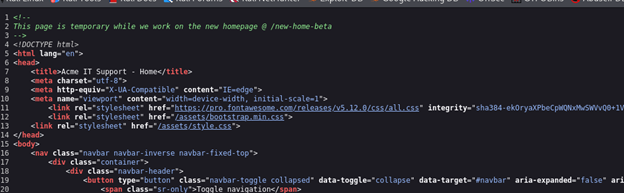
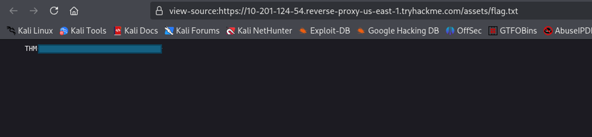
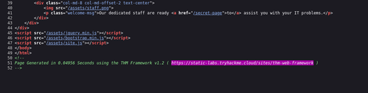

# Report: Walkthrough the Website 

**Room Link:** [https://tryhackme.com/room/walkinganapplication](https://tryhackme.com/room/walkinganapplication)

**Pathway:** Jr Penetration Tester

**Room:** Walking an Application

**Author:** Syed Fahad Shah

**Date:** 16 Aug 2025

## Objectives: 
This room tells about the first step a pentester should taken when working with a website. It also cover the manual techinques for website inspection as automation tools and script sometimes miss some useful information

## Tools Covered:
The room cover the developer tools and four main thing in the browser developer tools:
1- View page source
2- Inspector
3- Debugger
4- Network Tab

## Walkthrough:

### Task 1 - Walking an Application
- Deployed the virtual machine and navigated to the provided url
- Observed the landing page of the ACME website for the context

### Task 2 - Exploring the Website
- Visit the multiple pages present on the website
- Document the important things on each page for example /news/article?id={no} shows different articles and some are premieum.

### Task 3 - Viewing the Page source
- Right click on the page and click view source page.
- Source page tells all the information available for the page in the html form.
- Comments on the source page are the inforation developer leaves for themselve so if someone review the code they understand what code is doing.
- Sometimes developers forget to remove the comment they add during development that might contain some useful information
#### Q1:
-While viewing page source, the 1st line comments says there is a page at /new-home-beta

- insert in url /newhomebeta and there is flag.

#### Q2:
-Read the source code and there is a line having a link of a secret page `<a href='/secret-page'>to</a>`
-click on the link it will redirect to new page with the flag for second question.

#### Q3:
- To find the answer of this question one have search for the directory link in the code
- There is one link in the code of the `assests/styles.css` file

- Click the link and then remoce the styles.css from url it will show all the files in the asset directory

- Click on `flag.txt` file and it will show the flag

#### Q4:
-Look on the source code and check for the framework information

-The last line comment shows the framework information website is using click on it

-Check the information present on different pages
-The change logs page tells information about the file framework was generating due to bug

-move back to acme website and go the /assests that we have already used
-remove the assests and write /tmp.zip
-zip file will be downloaded and have the flag of the question.

### Task 4 - Using Developer Tools

#### Q1: Inspector Tool
The **Inspector** allows us to view all the content that exists on a webpage, even if CSS styling is hiding some of it. Although we can temporarily change HTML or CSS through Inspector, these changes revert once the page is refreshed since the server sends the original styling again.

On the ACME news page, the third article was marked as premium and required a subscription. 

By inspecting the premium block, I found the `
` with the class name `premium-customer-blocker`, which was responsible for hiding the content.

There were two ways to reveal the hidden content:
1. **Remove the class name** from the `
`, which removes its styling restrictions.

3. **Modify the CSS property**: change the `display` value from `block` to `none`.

After applying either method, the hidden premium content was revealed, along with the flag.

---

#### Q6: Debugger Tool
The **Debugger** lets us analyze and control how JavaScript executes in the browser.  

Steps taken:
1. Opened **Inspector → Debugger** tab.  
2. Navigated to `assets/flash.min.js`.  
3. Made the file readable by clicking the `{ }` (pretty-print) option.  
4. At line 110, I identified code responsible for showing a flash message for only 5 milliseconds using `setTimeout()`.  
5. I set a breakpoint on that line to stop execution.  

Then, after reloading the page, the flash content stayed visible instead of disappearing, revealing the next flag.

---

#### Q7: Network Tab
The **Network** tab records all requests and responses between the client and server. This is especially useful to analyze hidden requests (like AJAX).  

Steps taken:
1. Navigated to the **Contact page** of the ACME website.  
2. Opened the **Network** tab in Developer Tools.  
3. Filled out and submitted the form.  
4. Observed the new network request triggered in the background using **AJAX** (Asynchronous JavaScript and XML).

  

Clicking the new request shows its content and revealed the flag for the final question.

---

## Conclusion
This room demonstrated how manual inspection of a web application using browser developer tools can uncover hidden information that automated tools might miss. Key takeaways include:
- **View Page Source**: Identify hidden pages, comments, and exposed files.  
- **Inspector**: Reveal or alter CSS/HTML to bypass client-side restrictions.  
- **Debugger**: Intercept and control JavaScript execution to expose hidden data.  
- **Network Tab**: Track AJAX requests and responses to extract valuable information.  

These skills form a critical foundation for penetration testing and web application security analysis.

